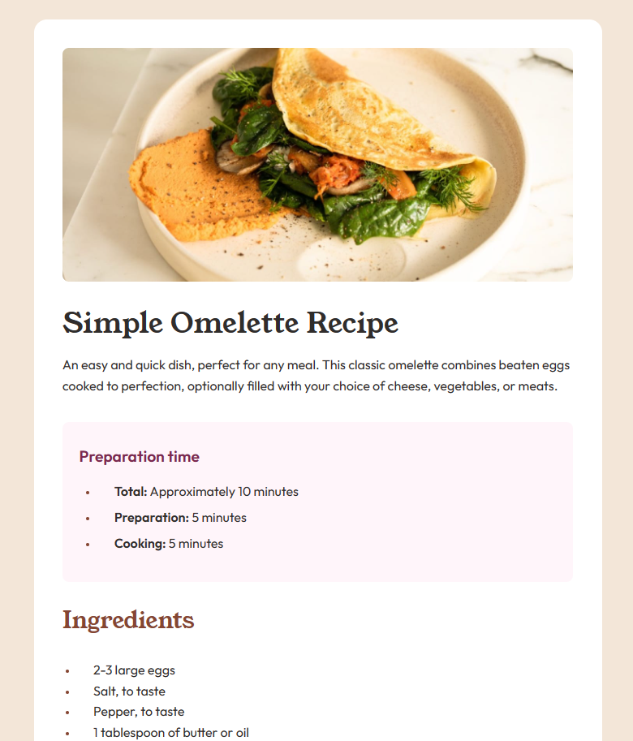

# Frontend Mentor - Recipe page solution

This is a solution to the [Recipe page challenge on Frontend Mentor](https://www.frontendmentor.io/challenges/recipe-page-KiTsR8QQKm). Frontend Mentor challenges help you improve your coding skills by building realistic projects.

## Table of contents

- [Overview](#overview)
  - [The challenge](#the-challenge)
  - [Screenshot](#screenshot)
  - [Links](#links)
  - [Built with](#built-with)
  - [What I learned](#what-i-learned)
- [Author](#author)

## Overview

### Screenshot

### Links

- Solution URL: [Add solution URL here](https://github.com/DanCodeCraft/FEM-RecipePage)
- Live Site URL: [Add live site URL here](https://fem-recipe-page-jet.vercel.app/)

### Built with

- Semantic HTML5 markup
- CSS custom properties
- Flexbox
- CSS Grid
- Media Queries
- Desktop-first workflow

### What I learned

I used a mix of elements, added a table at the end and also implemented the same thing using grid just for practice.
It was a good learning to manipulate lists and style the markers.

## Author

- Website - [LinkedIn](https://www.linkedin.com/in/adannjacinto/)
- Frontend Mentor - [@DanCodeCraft](https://www.frontendmentor.io/profile/DanCodeCraft)
- Twitter - [@DanCodeCraft](https://www.twitter.com/DanCodeCraft)
